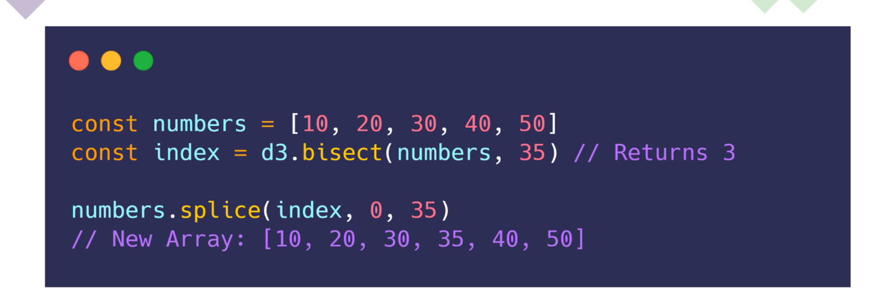

# Understanding D3 & Data Visualization

- Data visualization
  - is the ability to convey a story or an idea as efficiently as possible
  - makes it easy to identify certain patterns or disruptions in data
  - made up of shapes, size and color

## D3 (Data Driven Documents)

- helps to close gap between data and visualization on the web
- helps to calculate size, shape, color and position

- `Data`
  - JSON, CSV, plain text etc.
  - data should drive the visualization; NOT other way around
- `Document`
  - HTML webpage
  - represents the data; the visual will depend on the data itself and not dictate what the data should be

## SVG (Scalable Vector Graphics)

- regular images based on pixels are `JPG`, `JPEG`, `PNG`, `BMP`, `GIF`
- vector images generated and manipulated with code are `SVG`

  - vectors are created using math equations and commands

- `<svg>` element: order of elements inside this container is only defined by order of appearance

```HTML
<svg width="500" height="500">
  <!-- ... vector elements -->
</svg>
```

- `<rect>` element: creates a rectangle shape
  - `fill`: background color of shape
  - `stroke`: border color
  - `stroke-width`: border width
  - specific for strokes: half stroke width is inside element, and half outside
  - by default svg is set to `overflow`: hidden
    - solution: 1) svg -> overflow: visible; 2) position rect with x and y attributes, standing for coordinates inside svg container

```HTML
<rect x="25" y="25" width="100" height="100" fill="#f44336" stroke="#8bc34a" stroke-width="10"></rect>
```

- `<circle>` element: creates a circle shape
  - `r`: radius
  - `cx`: coordinate on x axis inside svg to position circle
  - `cy`: coordinate on y axis inside svg to position circle

```HTML
<circle r="100" cx="250" cy="150" fill="#9c28b0"></circle>
```

- `<line>` element: creates a line shape
  - `x1`, `y1`: starting coordinates
  - `x2`, `y2`: ending coordinates
  - `stroke`: lines do NOT have `fill` to fill color

```HTML
<line x1="100" y1="100" x2="200" y2="200" stroke="blue" stroke-width="5"></line>
```

- `<path>` element: most powerful shape because it can be conformed to draw every shape
  - Article: <https://www.mediaevent.de/tutorial/svg-path.html>
  - `d` (short for data): list of commands and coordinates
  - `M, m` move to point: instructs SVG to move the "pen" to certain coordinates (by default "pen" starts at 0,0)
  - `Z, z` close path: at the end of list of coordinates closes the path to a shape
  - `L, l` draw line to: großes L = gehe absolutem Punkt x/y; kleines l = relativer path, gehe x/y Einheiten
  - `C, c` und `S, s`: Cubic Bézierkurve
  - `Q, q` und `T, t`: Quadratische Bézierkurve
  - `S,s` smooth: cubic curve to
  - `A, a` Elliptical Arc: Kreisbogen oder elliptischer Bogen
  - `stroke-dasharray`="50,5" bestimmt die Länge des durchgehenden Teilstücks (50), der zweite (5) die Breite der Lücken
  - `stroke-dashoffset` liegt zwischen 0 und dem ersten Wert von stroke-dasharray und legt den Anfang der ersten Teillinie fest.
  - `stroke-linecap`="round" für gepunktete Linie

```HTML
<path d="M300,300 L300,200 L200,200 Z" fill="red" stroke="#000" stroke-width="5"></path>
```

- `<g>` element is a container used to group other SVG elements
  - all presentation attributes are inherited to child elements
- `viewBox` attribute is needed for responsive layout: `viewBox="x y width height"` (-> xy = starting point)

```HTML
<svg viewBox="0 0 100 100" xmlns="http://www.w3.org/2000/svg">
  <g fill="white" stroke="green" stroke-width="5">
    <circle cx="40" cy="40" r="25" />
    <circle cx="60" cy="60" r="25" />
  </g>
</svg>
```


## Install D3

> GitHub Repository of D3 Library: <https://github.com/d3/d3>

> GitHub Repositories of specific parts of D3 libraries: <https://github.com/d3>

> Overview of available D3 modules (-> APIs): <https://github.com/d3/d3/blob/main/API.md>

- package has big size, so it's split in multiple parts to save data volume
- with `ES6 modules` you can import only specific symbols from specific D3 modules

  - e.g. `import {scaleLinear} from "d3-scale"`

- install d3: `npm install d3`
- types for TypeScript: `npm install --save-dev @types/d3`

## Selections

- `selections`: objects that represent HTML elements in the `DOM`
  - methods that select or create elements return always the selection

> <https://github.com/d3/d3-selection>

```JavaScript
// Native
document.querySelector('p');

// D3
// similar to select elements with native browser API
d3.select('p');

d3.selectAll('p');

// append new element as last child to selected element
// returns a selection (here based on 'p')
const body = d3.select('body');
const p = body.append('p');
```

## Modyfiying Elements

> <https://github.com/d3/d3-selection#modifying-elements>

- a modifying method returns always the selection
- you can chain multiple modifying methods together

```JavaScript
// attr(): adds (OR overwrites) attributes to specific element; can be placed on any position in the method chain
// text(): replaces text content of element
const el = d3.select('body')
  .append('p')
  .attr('i', 'foo')
  .classed('bar baz', true) // truthy = classes are assigned to elements; falsy = unassigned
  .text('Hello World')
  .style('color', 'blue');
```

## Joining Data

- data for D3 is only `text` and `numbers`
- process of associating a piece of data with an element is known as `joining data`
- then you can manipulate the shape of an element based on a data point


- `data()`: array of selections and array of data is joined (first selection with first item etc.)
  - in element property list you can find `__data__: 10` etc.
  - returns `_enter` property of selection: tells if more data items than elements (-> how many data items could not be joined)
  - returns `_exit` property of selection: tells if more selected elements than data items (-> how many selected elements could not be joined)
- `join(<string>|<cb fn>)`: handles balance if not exact number in selections array and data array
  - generates new elements if there were more data items than elements before and appends these new elements to parent of selection (-> here: you need additional `select('ul')`, otherwise html element would be parent)
  - OR removes elements if more selected elements than data items

```HTML
<ul>
  <li>ListItem</li>
  <li>ListItem</li>
  <li>ListItem</li>
</ul>
```

```JavaScript
const data = [10, 20, 30, 40, 50];

// Example 1
const element = d3
  .select('ul')
  .selectAll('li')
  .data(data)
  .join('li')
  .text((d) => d); // insert string OR cb fn that provides data parameter);
```

```JavaScript
// Example 2
const element = d3
.select('ul')
.selectAll('li')
.data(data)
.join(
  // enter parameter: selection containing new created elements
  (enter) => {
    // return enter.append('li'); // default behavior ('li' is example)
    return enter.append('li').style('color', 'purple');
  },
  // update parameter: selection containing elements that are already in existence
  (update) => {
    // return update; // default behavior
    return update.style('color', 'green');
  },
  // exit parameter: selection containing elements that need to to be removed
  (exit) => {
    // return exit.remove(); // default behavior
    return exit.style('color', 'green');
  }
)
.text((d) => d);
```

## JSON Requests

- data origin:

  1. hard coded into JavaScript file
  1. file (`JSON`, `CSV` etc.)
  1. API

> `d3-fetch` library: <https://github.com/d3/d3-fetch>

## Drawing a Chart


### Steps for Drawing a Chart

1. get data
1. draw chart dimensions
1. draw image
1. create scales
1. draw shapes
1. draw axis
1. add animation and events

### Accessor Function

- `accessor function` can access and return a property of an object

```TypeScript
const xAccessor = (d: DataItem) => d.currently.humidity;
const yAccessor = (d: DataItem) => d.currently.apparentTemperature;

container
  .selectAll('circle')
  .data(dataset)
  .join('circle')
  // accessor cb function to get specific property in data item object
  // draw humidity on x axis (cause value should ALWAYS be drawn on x axis, effect on y axis)
  .attr('cx', xAccessor)
  .attr('cy', yAccessor)
```

### Generator Function

> Documentation `D3 Shape`: <https://github.com/d3/d3-shape>

- generates a path in the svg `d` property shape
- `Example`: `d3.line()` returns generator to draw a line

```TypeScript
// [6] PATH GENERATOR
const lineGenerator = d3
  .line<DataItem>()
  .x((d) => xScale(xAccessor(d)!))
  .y((d) => yScale(yAccessor(d)!));

// ...

// [7] DRAW SHAPE -> PATH
container
  .append('path')
  .datum(dataset) // datum() instead of data() path is 1 element, so have to join whole dataset to this element
  .attr('d', lineGenerator)
  .attr('fill', 'none') // by default line path is filled
  .attr('stroke', '#4a4a4a')
  .attr('stroke-width', 2);
```

### Bisectors

- a `bisector` is a function that helps to locate where to insert an element into an array to maintain a sorted array



### Scales

> Documentation <https://github.com/d3/d3-scale>

- `scales` harmonize the dimension of a viewing area AND a chart -> i.e. mapping a dimension of abstract data to a visual representation -> `without scales`: data does NOT match the available space in the chart
- `Example`: on various screen resolutions, you can upscale or downscale the position of your data points to adjust them to the screen size and make them visible and readable
- in `d3` specific `scale functions` are implemented for different use cases
  - they take in data and return new data that can be used for positioning a shape, changing its dimensions, or changing its color: `Input`-> `Scale` -> `Output`
- `Example`: `const dataset = [100, 200, 300, 400, 500]`
  - `Input Domain`: a range of possible values within the data (-> `100`, `500`)
  - `Output Range`: size of the static viewing area (-> e.g. `0` to `max width of viewing area`)

```TypeScript
// Example for Scales
const dataset = [100, 200, 300, 400, 500];

//  d3.extent(array, cb accessor fn) does the same, BUT cb is useful for accessing deeper nested properties in array of objects
// const getDomain = (array: number[]): [number, number] => [Math.min(...array), Math.max(...array)];
// console.log(getDomain(dataset));

const scale = d3.scaleLinear().domain(d3.extend(dataset)).range([10, 350]);

scale(100); // 10
scale(500); // 350
```

#### Continuous vs Discrete Scales

- if a dataset is continuous or discrete will narrow down the choices of a scale
- `continuous` data
  - can be measured
  - can be broken down into fractions or decimals
  - `infinite` possible values
  - `Examples`: temperature, height, distance, time
- `discrete` data

  - can be counted
  - can NOT be broken down into fractions or decimals
  - `finite` possible values
  - `Examples`: number of books in a library etc.

#### Linear Scale

- `scaleLinear()`: input `domain` AND output `range` are `continuous`


```JavaScript
const scale = d3.scaleLinear()
  .domain([10, 90])
  .range([0, 720]);

scale(10); // 0
scale(90); // 720
scale(47.35); // 336.15000000000003
scale(5); // -45
scale(100); // 810
```

- set a color range as output: `d3` converts `color names` or `hex` codes into range of `rgb`


```TypeScript
// Problem: linear scale transforms continuous scale into continuous (x different data points to x different colors) -> hard to read
// Better solution: using other scale to transform into discrete output scale (limited number of colors)
const colorScale: ScaleLinear<string, string> = d3
  .scaleLinear<string, string>() // define string as output range for colors
  .domain(<[number, number]>d3.extent(dataset))
  .range(['white', 'red']); // d3 converts color names into range of rgb
```

#### Quantize Scale

- `scaleQuantize()`: input `domain` is `continuous` AND output `range`is `discrete`
  - you define how many output `buckets` are possible in the scale (e.g. for household income: lower, middle, upper class)
  - takes biggest value of input `domain`, divides it into `x` equal areas and distributes input values in these `x` buckets


```TypeScript
const colorScale: ScaleQuantize<string> = d3
  .scaleQuantize<string>()
  .domain(<[number, number]>d3.extent(dataset))
  .range(['white', 'pink', 'red']);
```

#### Quantile Scale

- `scaleQuantile()`: input `domain` is `continuous` AND output `range`is `discrete`
  - in contrast to the `quantize` scale, this takes the number (!) of values of input `domain` and divides them into equal parts, each with the same number of values


```TypeScript
const colorScale: ScaleQuantile<string> = d3
  .scaleQuantile<string>()
  .domain(dataset) // pass in entire dataset -> d3 has to figure out how many data items exist
  .range(['white', 'pink', 'red']);
```

#### Threshold Scale

- `scaleThreshold()`: input `domain` is `continuous` AND output `range`is `discrete`
  - more customizable than other scales above: `d3` calculates the size of a `bucket`
  - `threshold` is a level, rate or amount at which something comes into effect
    - `quantize` scale sets thresholds based on the data
    - `quantile` scale sets thresholds based on the data AND the number of items in the array
    - `threshold` scale: you can set custom thresholds


```TypeScript
const colorScale: ScaleThreshold<number, string> = d3
  .scaleThreshold<number, string>()
  .domain([45200, 135600]) // pass in array with your thresholds
  .range(['white', 'pink', 'red']);
```

#### Log Scale

> Article about Log Scales: <https://medium.com/@kyawsawhtoon/log-transformation-purpose-and-interpretation-9444b4b049c9>

- input `domain` AND output `range` are `continuous`
- applies a logarithmic transformation on your domain before transforming it
- use case: when dealing with exponential values and you recognize the `skewing` problem, try `log scale`
- common types of data a log scale is used for: corona infections, money, time, distance


```TypeScript
// Example Project 5
const universeScale = d3
  // .scaleLinear() // // Skewing Problem: Linear Scale does NOT work since distance between biggest and smallest item is too great
  .scaleLog()
  .domain(<[number, number]>d3.extent(dataset, getSize))
  .range([dimensions.height - dimensions.margin, dimensions.margin]); // scale lowest value to highest point on screen and vice versa
```

#### Time Scale

- `d3.scaleTime()` or `d3.scaleUtc()`: input `domain` AND output `range` are `continuous`
- `scaleTime` and `scaleUtc` transform `Date` object into number
- `scaleUtc`: constructs a new time scale based on the Coordinated Universal Time (UTC) with the specified range -> time is equal no matter where you are living

```TypeScript
// Example Project 7
const xScale = d3
  // .scaleTime<number, number>()
  .scaleUtc<number, number>()
  .domain(<[Date, Date]>d3.extent(dataset, xAccessor))
  .range([0, dimensions.containerWidth]);
```

#### Ordinal Scale

- `d3.scaleOrdinal()`: input `domain` AND output `range` are `discrete`
- allows to transform "things" (e.g. month in a year, names of people or locations)


```TypeScript
// Example Project 9
const colorScale = d3
  .scaleOrdinal() // can convert x group names into x colors
  .domain(stackData.map((d) => d.key))
  .range(d3.schemeSpectral[stackData.length])
  .unknown('#ccc'); // fallback color if ordinal scale is probably not able to scale group name to a color
```

#### Band Scale

- `d3.scaleBand()`: input `domain` is `discrete` AND output `range` is `contiuous`
- allows to transform categorial data (e.g. given number of states like age groups) into numbers (e.g. width of a screen element)


```TypeScript
// Example Project 9
const xScale = d3
  .scaleBand<string>()
  .domain(dataset.map((state) => state.name)) // pass ALL discrete categories (-> "name") into input domain
  .range([dimensions.margin, dimensions.containerWidth])
  // .paddingInner(0.1)
  // .paddingOuter(0.1)
  .padding(0.1); // add padding (equal value for paddingInner/paddingOuter): 0.1 -> 10% of the bandwidth
```

### Axis

> Documentation: <https://github.com/d3/d3-axis>

- `d3.axisTop()`: ticks are drawn above horizontal line
- `d3.axisBottom()`: ticks are drawn below horizontal line
- `d3.axisLeft()`: ticks are drawn left of vertical line
- `d3.axisRight()`: ticks are drawn right of vertical line

### Color Schemes

> Documentation: <https://github.com/d3/d3-scale-chromatic>

- list of pre-configured color schemes to use for your scales: [1] `Categorical`, [2] `Diverging`, [3] `Sequential (Single Hue)`, [4] `Sequential (Multi-Hue)`, [5] `Cyclical`
- each scheme has:

  - a `interpolateNAME_OF_SCHEME` function: you pass in a value between 0 and 1 and get returned a color at this specific position of the scheme range

  ```TypeScript
  d3.interpolateRdYlGn(0);
  d3.interpolateRdYlGn(0.4);
  d3.interpolateRdYlGn(1);

  // when you need more than 11 colors, you can NOT use `schemeNAME_OF_SCHEME()`
  // you have to generate colors with quantize() that loops through 1st argument cb fn x times (-> here dataset.length)
  // parameter t = evenly distributed number between 0 and 1
  // -> eta reduction of cb function possible: d3.interpolateSpectral
  const colors = d3.quantize((t) => d3.interpolateSpectral(t), dataset.length);
  const colorScale = d3
    .scaleOrdinal<string>()
    .domain(dataset.map((item) => item.name)) // pass in array of ALL name properties of dataItem object
    .range(colors);
  ```

  - a `schemeNAME_OF_SCHEME` readonly property: returns array of arrays with index between `3` and `11`, index number indicates number of `hex` colors in the specific array

  ```TypeScript
  const colorScale: ScaleThreshold<number, string> = d3
    .scaleThreshold<number, string>()
    .domain([45200, 135600]) // pass in array with your thresholds
    .range(d3.schemeReds[3]); // using color scheme with 3 hex colors (get theme with index 3)
  ```

### Chart type: Histogram

- `histogram` tells the distribution of data items of a given dataset: e.g. how many numbers are in a certain range

- you have to `format` your data so that the data items are grouped together as you like


- use `d3.bin()` to group together your data into non-overlapping intervals
  - <https://github.com/d3/d3-array#bins>

### Chart type: Bar Charts

- `histograms` show a frequency of data
- `bar charts` show individual points of data for comparison


## Example of Scatterplot

```TypeScript
import './style.css';
import * as d3 from 'd3';

type DataItem = Record<string, any>;
type Dataset = DataItem[] | undefined;

interface Dimensions {
  width: number;
  height: number;
  margin: {
    top: number;
    bottom: number;
    left: number;
    right: number;
  };
  containerWidth?: number;
  containerHeight?: number;
}

const convertFahrenheitToCelsius = (number: number) => ((number - 32) * 5) / 9;

const draw = async () => {
  // [1] GET DATA
  const dataset: Dataset = await d3.json('/data/data.json');
  if (!dataset) return;

  const xAccessor = (d: DataItem) => d.currently.humidity;
  const yAccessor = (d: DataItem) => convertFahrenheitToCelsius(d.currently.apparentTemperature);

  // [2] DIMENSIONS OF SVG GROUP AND CONTAINER FOR CHART ITEMS
  const dimensions: Dimensions = {
    width: 800,
    height: 800,
    margin: {
      top: 50,
      bottom: 50,
      left: 50,
      right: 50,
    },
  };

  dimensions.containerWidth = dimensions.width - dimensions.margin.left - dimensions.margin.right;
  dimensions.containerHeight = dimensions.height - dimensions.margin.top - dimensions.margin.bottom;

  // [3] DRAW IMAGE (-> EMPTY CHART)
  const svg = d3.select('#chart').append('svg').attr('width', dimensions.width).attr('height', dimensions.height);

  // <g> element is a container used to group other SVG elements
  // all presentation attributes are inherited to child elements
  const container = svg.append('g').attr('transform', `translate(${dimensions.margin.left}, ${dimensions.margin.top})`);

  // [4] CREATE SCALES
  // d3.extent(array, cb accessor fn) returns input domain [number, number]
  // TypeScript solution: https://stackoverflow.com/questions/52124689/argument-of-type-string-string-error-in-angular-and-d3
  const xScale = d3
    .scaleLinear()
    .domain(<[number, number]>d3.extent(dataset, xAccessor))
    .rangeRound([0, dimensions.containerWidth]) // rangeround() instead of range() will round output range
    .clamp(true); // clamp() forces scale function not to transform values that are passed in as arguments and outside of input range

  const yScale = d3
    .scaleLinear()
    .domain(<[number, number]>d3.extent(dataset, yAccessor))
    .rangeRound([dimensions.containerHeight, 0]) // reverse output numbers range (-> because data point 0 should be at bottom of chart, NOT at top)
    .nice() // nice(): applied to input domain, start + end number is rounded (-> look at data, if usefull or not)
    .clamp(true);

  // [5] DRAW SHAPES
  // a) selectAll founds nothing in DOM
  // b) then dataset is applied,
  // c) data array of selections and array of data is joined, join creates new circles for every data item
  container
    .selectAll('circle')
    .data(dataset)
    .join('circle')
    // accessor cb function to get specific property in data item object
    // draw humidity on x axis (cause value should ALWAYS be drawn on x axis, effect on y axis)
    .attr('cx', (d) => xScale(xAccessor(d)))
    .attr('cy', (d) => yScale(yAccessor(d)))
    .attr('r', 4)
    .attr('fill', 'orange')
    .attr('data-temp', yAccessor); // to see which circle represents which data point

  // [6] DRAW AXIS
  // add scale function for correct scale
  const xAxis = d3
    .axisBottom(xScale)
    .ticks(5) // overwrites number of ticks (d3 figures out if number can be distributed evenly OR if d3 has to take another number)
    // .tickValues([0.4, 0.5, 0.8]); // define custom ticks
    .tickFormat((d) => (typeof d === 'number' ? `${d * 100}%` : '')); // transform original label to another value

  // append axis as new group (<g>) at the end of our container
  // move axis to bottom of container
  const xAxisGroup = container
    .append('g')
    .call(xAxis)
    .style('transform', `translateY(${dimensions.containerHeight}px`)
    .classed('axis', true);

  // append svg <text> element and position it inside xAxisGroup selection
  xAxisGroup
    .append('text')
    .attr('x', dimensions.containerWidth / 2)
    .attr('y', dimensions.margin.bottom - 10)
    .attr('fill', 'black')
    .text('Humidity');

  const yAxis = d3.axisLeft(yScale);
  const yAxisGroupe = container.append('g').call(yAxis).classed('axis', true);
  yAxisGroupe
    .append('text')
    .attr('x', -dimensions.containerHeight / 2) // minus because of rotation
    .attr('y', -dimensions.margin.left + 15) // minus because of rotation
    .attr('fill', 'black')
    .html(`Temperature &deg;C`) // html() replaced here text() because want to draw HTML entity inside string
    .style('transform', 'rotate(270deg)')
    // 'text-anchor' is alignment property for svg only
    // 'middle': middle of text is exactly the value of x coordinate (-> here because of rotation)
    .style('text-anchor', 'middle');
};

draw();
```

- `shape-rendering` CSS property: for SVG elements to define tradeoff between performance and accuracy: <https://developer.mozilla.org/en-US/docs/Web/SVG/Attribute/shape-rendering>

```CSS
.axis {
  shape-rendering: geometricPrecision;
}
```

### Animation

> Documentation `D3 Transition`: <https://github.com/d3/d3-transition>

- animates any property
- synchronizes animations
- plays animations in sequence
- allows animations to be interrupted

- possible `problems`:

  - new created elements start at coordinates `0,0`, so animation transition starts at this point - `solution`: change starting position
  - removed elements do NOT get animated - `solution`: use specific cb functions available as arguments of `join()`

- `transition()`
  - returns selection with methods to animate properties of selection
  - animates properties that are modified AFTER that function was integrated
  - properties (e.g. `width` ...) set BEFORE transition() are NOT animated

```TypeScript
// [9] ANIMATION
// set order of animationn
// each definition has an '_id' property that d3 can identify it when you pass one as argument into transition() -> look below
// Matching animations: if multiple animations plays at once, d3 checks if they have same id and synchronize them
const exitTransition = d3.transition().duration(500);
const updateTransition = exitTransition.transition().duration(500);

// [6] DRAW SHAPES - BARS
// NOW: all bars are drawn (even if they overlap)
container
  .selectAll('rect')
  .data(newDataset)
  .join(
    // define new created elements and their starting shape -> they are merged with current selection
    (enter) =>
      enter
        .append('rect')
        .attr('width', (d) => d3.max([0, xScale(d.x1!) - xScale(d.x0!) - padding]) || 0)
        .attr('height', 0) // height = 0
        .attr('x', (d) => xScale(d.x0!))
        .attr('y', dimensions.containerHeight) // position bars at bottom of y axis
        .attr('fill', '#b8de6f'),
    // define list of elements that need to be updated
    (update) => update,
    // define list of elements that need to be removed
    (exit) =>
      exit
        .attr('fill', '#f39233') // add before transition() since color should change without transition
        .transition(exitTransition)
        .attr('y', dimensions.containerHeight) // position bars before remove
        .attr('height', 0) // height before remove
        .remove()
  )
  // [9] ANIMATION
  .transition(updateTransition)
  .attr('width', (d) => d3.max([0, xScale(d.x1!) - xScale(d.x0!) - padding]) || 0)
  .attr('height', (d) => dimensions.containerHeight - yScale(yAccessor(d)))
  .attr('x', (d) => xScale(d.x0!))
  .attr('y', (d) => yScale(yAccessor(d)))
  .attr('fill', '#01c5c4');

labelsGroup
  .selectAll('text')
  .data(newDataset)
  .join(
    (enter) =>
      enter
        .append('text')
        .attr('x', (d) => xScale(d.x0!) + (xScale(d.x1!) - xScale(d.x0!)) / 2)
        .attr('y', dimensions.containerHeight)
        .text(yAccessor),
    (update) => update,
    (exit) =>
      exit
        .transition(exitTransition)
        .attr('y', dimensions.containerHeight) // label go down with bars
        .remove()
  )
  .transition(updateTransition)
  .attr('x', (d) => xScale(d.x0!) + (xScale(d.x1!) - xScale(d.x0!)) / 2)
  .attr('y', (d) => yScale(yAccessor(d)) - 10)
  .text(yAccessor);

// [7] AXIS
const axis = d3.axisBottom(xScale);
xAxisGroup.transition().call(axis);
```

### Add Average (= Mean) Line to a Chart

```TypeScript
// Example Project 6
const meanLine = container.append('line').classed('mean-line', true);

// ... [4] SCALE
// ... [5] DATA GROUPING FOR HISTOGRAM
// ... [6] DRAW SHAPES - BARS

// calculate the mean (average) of our original dataset (not grouped newDataset) of the values returned by xAccessor
const mean = d3.mean(dataset, xAccessor);

// straight line from bottom to top
meanLine
  .raise() // reinserts an element at the end of its parent block
  .transition(updateTransition)
  .attr('x1', xScale(mean!))
  .attr('y1', 0)
  .attr('x2', xScale(mean!))
  .attr('y2', dimensions.containerHeight);
```

### Format Numbers and Dates

> Documentation `D3 Format`: <https://github.com/d3/d3-format>
> Documentation `D3 Time Format`: <https://github.com/d3/d3-time-format>

### Adding Tooltips

```TypeScript
// Example Project 3
const tooltip = d3.select(tooltipSelector);

// data object joined to rect element is available as 2nd parameter
// since `dataset` is connected to elements with data(dataset)
const handleMouseenter = ({ target }: { target: SVGRectElement }, datum: DataItem) => {
  d3.select(target).attr('fill', '#120078').attr('r', 8);

  // Docu: https://github.com/d3/d3-format
  const formatter = d3.format('.2f');
  // Docu: https://github.com/d3/d3-time-format
  const dateFormatter = d3.timeFormat('%B %-d, %Y');

  tooltip
    .style('display', 'block')
    .style('top', `${yScale(yAccessor(datum)) - 40}px`) // position tooltip on top of circle
    .style('left', `${xScale(xAccessor(datum))}px`);

  tooltip.select('.metric-humidity > span').text(`${Math.round(xAccessor(datum) * 100)}%`);
  tooltip.select('.metric-temperature > span').text(formatter(yAccessor(datum)));
  const dateInMs = new Date(datum.currently.time * 1000);
  tooltip.select('.metric-date').text(dateFormatter(dateInMs));
};

const handleMouseleve = ({ target }: { target: SVGRectElement }) => {
  d3.select(target).attr('fill', 'orange').attr('r', 5);

  tooltip.style('display', 'none');
};

// ...
container
  .selectAll('circle')
  .data(dataset)
  .join('circle')
  .attr('cx', (d) => xScale(xAccessor(d)))
  .attr('cy', (d) => yScale(yAccessor(d)))
  .attr('r', 4)
  .attr('fill', 'orange')
  .attr('data-temp', yAccessor)
  .on('mouseenter', handleMouseenter)
  .on('mouseleave', handleMouseleve);
```

### Voronoi Diagram

> Documentation `D3 Delaunay`: <https://github.com/d3/d3-delaunay>

- it's a diagram that can tell you the shortest distance to react a specific location
- `use case`: you can use it in a scatterplot (-> `example project 3`) to detect which data point is the closest to the mouse cursor position to show a tooltip


```TypeScript
// Example Project 3
const tooltip = d3.select(tooltipSelector);

const handleMouseenter = (event: MouseEvent, datum: DataItem) => {
  // FOR OPTION 2 WITH VORONOI: create new circle
  container
    .append('circle')
    .classed('dot-hovered', true)
    .attr('fill', '#120078')
    .attr('r', 8)
    .attr('cx', (d) => xScale(xAccessor(datum)))
    .attr('cy', (d) => yScale(yAccessor(datum)))
    // have to set that ALL events on this event will be ignored
    // otherwise when hovering over new created circle, mouseleave event of 'path' element would be triggered
    .style('pointer-events', 'none');

  const formatter = d3.format('.2f');
  const dateFormatter = d3.timeFormat('%B %-d, %Y');

  tooltip
    .style('display', 'block')
    .style('top', `${yScale(yAccessor(datum)) - 40}px`) // position tooltip on top of circle
    .style('left', `${xScale(xAccessor(datum))}px`);

  tooltip.select('.metric-humidity > span').text(`${Math.round(xAccessor(datum) * 100)}%`);
  tooltip.select('.metric-temperature > span').text(formatter(yAccessor(datum)));
  const dateInMs = new Date(datum.currently.time * 1000);
  tooltip.select('.metric-date').text(dateFormatter(dateInMs));
};

const handleMouseleve = (event: MouseEvent) => {
  // FOR OPTION 2 WITH VORONOI
  container.select('.dot-hovered').remove();

  tooltip.style('display', 'none');
};

// ...

// [7] VORONOI DIAGRAM WITH D3 DELAUNAY LIBRARY
// to detect which datapoint is closest to mouse cursor position
// goal: improve UX for mouse events
const delaunay = d3.Delaunay.from(
  dataset,
  (d) => xScale(xAccessor(d)), // x coordinate
  (d) => yScale(yAccessor(d)) // y coordinate
); // returns object with coordinates to draw the voronoi diagram

const voronoi = delaunay.voronoi(); // generates functions to draw the voronoi diagram
voronoi.xmax = dimensions.containerWidth; // set dimensions of scatterplot
voronoi.ymax = dimensions.containerHeight;

container
  .append('g')
  .selectAll('path') // no paths exist
  .data(dataset) // joins dataset items with selected elements
  .join('path') // creates new paths to match with dataset items
  .attr('stroke', 'grey')
  .attr('fill', 'transparent')
  .attr('d', (d, index) => voronoi.renderCell(index)) // renderCell returns coordinates that paths can be drawn (-> 'd' property)
  // OPTION 2: attached to voronoi areas
  .on('mouseenter', handleMouseenter)
  .on('mouseleave', handleMouseleve);
```

## Example of Heatmaps with different scales

```TypeScript
import './style.css';
import * as d3 from 'd3';
import { ScaleLinear, ScaleQuantile, ScaleQuantize, ScaleThreshold } from 'd3';

type Dataset = number[] | undefined;

interface Dimensions {
  width: number;
  height: number;
}

const draw = async (elementSelector: string, scale: 'linear' | 'quantize' | 'quantile' | 'threshold') => {
  // [1] DATA
  // array of 100 numbers representing income of US households
  const dataset: Dataset = await d3.json('./data/data.json');
  if (!dataset) return;
  dataset.sort((a, b) => a - b); // sort data in ascending order

  // [2] DIMENSIONS
  const dimensions: Dimensions = {
    width: 600,
    height: 150,
  };

  const box = 30; // 100 data points: 600px/30px = 20; 150px/30px = 5; 20 * 5 = 100 items

  // [3] DRAW IMAGE
  const svg = d3
    .select(elementSelector)
    .append('svg')
    .attr('width', dimensions.width)
    .attr('height', dimensions.height);

  // [4] SCALES
  let colorScale:
    | ScaleLinear<string, string>
    | ScaleQuantize<string>
    | ScaleQuantile<string>
    | ScaleThreshold<number, string>;

  if (scale === 'linear') {
    // Problem: linear scale transforms continuous scale into continuous (100 different data points to 100 different colors) -> hard to read
    // Better solution: using other scale to transform into discrete output scale (limited number of colors)
    colorScale = d3
      .scaleLinear<string, string>() // define string as output range for colors
      .domain(<[number, number]>d3.extent(dataset))
      .range(['white', 'red']); // d3 converts color names into range of rgb
  } else if (scale === 'quantize') {
    colorScale = d3
      .scaleQuantize<string>()
      .domain(<[number, number]>d3.extent(dataset))
      .range(['white', 'pink', 'red']);

    console.log('Quantize thresholds:', (colorScale as ScaleQuantize<string>).thresholds());
  } else if (scale === 'quantile') {
    colorScale = d3
      .scaleQuantile<string>()
      .domain(dataset) // pass in entire dataset
      .range(['white', 'pink', 'red']);

    console.log('Quantile thresholds:', (colorScale as ScaleQuantile<string>).quantiles());
  } else if (scale === 'threshold') {
    colorScale = d3
      .scaleThreshold<number, string>()
      .domain([45200, 135600]) // pass in array with your thresholds
      .range(['white', 'pink', 'red']);
  }

  // [5] DRAW SHAPES -> RECTANGLES
  svg
    .append('g')
    .attr('transform', 'translate(2, 2)') // move group to have some spacing to container borders
    .attr('stroke', 'black') // representational attributes applied to <g> will be inherited to all child elements
    .selectAll('rect')
    .data(dataset)
    .join('rect')
    .attr('width', box - 3) // 3px = gap between rectangles
    .attr('height', box - 3)
    // map all rectangles on x and y axis
    .attr('x', (d, index) => box * (index % 20)) // [1st row] 0, 30, 60, 90, ... 570, [2nd row] 0, 30 ... 570, ...
    // use bitwise OR operator (does same as Math.floor()) to cut decimals
    .attr('y', (d, index) => box * ((index / 20) | 0)) // [first 20 cols -> until index 19] 0, [second 20 cols] 30
    .attr('fill', (d) => colorScale?.(d));
};

draw('#heatmap-1', 'linear');
draw('#heatmap-2', 'quantize');
draw('#heatmap-3', 'quantile');
draw('#heatmap-4', 'threshold');
```

## Example of Logarithmic Scale

```TypeScript
import './style.css';
import * as d3 from 'd3';

type DataItem = {
  name: string;
  size: number;
};
type Dataset = DataItem[] | undefined;

interface Dimensions {
  width: number;
  height: number;
  margin: number;
}

const draw = async (elementSelector: string) => {
  // [1] DATA
  // array of objects of things with their size in the universe
  const dataset: Dataset = await d3.json('./data/data.json');
  if (!dataset) return;

  const getName = (d: DataItem) => d.name;
  const getSize = (d: DataItem) => d.size;

  // [2] DIMENSIONS
  const dimensions: Dimensions = {
    width: 200,
    height: 500,
    margin: 50,
  };

  // [3] DRAW IMAGE
  const svg = d3
    .select(elementSelector)
    .append('svg')
    .attr('width', dimensions.width)
    .attr('height', dimensions.height);

  // [4] SCALE
  const universeScale = d3
    // .scaleLinear() // // Skewing Problem: Linear Scale does NOT work since distance between biggest and smallest item is too great
    .scaleLog()
    .domain(<[number, number]>d3.extent(dataset, getSize))
    .range([dimensions.height - dimensions.margin, dimensions.margin]); // scale lowest value to highest point on screen and vice versa

  // [5] DRAW SHAPES
  // CSS property 'dominant-baseline' to align svg elements: https://developer.mozilla.org/en-US/docs/Web/SVG/Attribute/dominant-baseline
  const circlesGroup = svg.append('g').style('font-size', '16px').style('dominant-baseline', 'middle');

  circlesGroup
    .selectAll('circle')
    .data(dataset)
    .join('circle')
    .attr('cx', dimensions.margin)
    .attr('cy', (d) => universeScale(getSize(d)))
    .attr('r', 6);

  circlesGroup
    .selectAll('text')
    .data(dataset)
    .join('text')
    .attr('x', dimensions.margin + 15) // position text label at right of circle
    .attr('y', (d) => universeScale(getSize(d)))
    .text(getName);

  // [6] ADD AXIS
  const axis = d3.axisLeft(universeScale);
  svg.append('g').attr('transform', `translate(${dimensions.margin}, 0)`).call(axis);
};

draw('#chart');
```

## Example of Histogram

```TypeScript
import './style.css';
import * as d3 from 'd3';

type DataItem = Record<string, any>;
type Dataset = DataItem[] | undefined;

interface Dimensions {
  width: number;
  height: number;
  margin: number;
  containerWidth: number;
  containerHeight: number;
}

const draw = async (elementSelector: string) => {
  // [1] DATA
  // array of objects of weather data
  const dataset: Dataset = await d3.json('./data/data.json');
  if (!dataset) return;

  const xAccessor = (d: DataItem): number => d.currently.humidity;
  const yAccessor = (d: any[]): number => d.length;

  // [2] DIMENSIONS
  const dimensions: Dimensions = {
    width: 800,
    height: 400,
    margin: 50,
    containerWidth: 0,
    containerHeight: 0
  };

  dimensions.containerWidth = dimensions.width - dimensions.margin * 2;
  dimensions.containerHeight = dimensions.height - dimensions.margin * 2;

  // [3] DRAW IMAGE
  const svg = d3
    .select(elementSelector)
    .append('svg')
    .attr('width', dimensions.width)
    .attr('height', dimensions.height);

  const container = svg.append('g').attr('transform', `translate(${dimensions.margin}, ${dimensions.margin})`);

  // [4] SCALE
  const xScale = d3
    .scaleLinear()
    .domain(<[number, number]>d3.extent(dataset, xAccessor))
    .range([0, dimensions.containerWidth])
    .nice(); // round domain values

  // [5] DATA GROUPING FOR HISTOGRAM
  const bin = d3
    .bin<DataItem, number>()
    .domain(<[number, number]>xScale.domain()) // provides your defined input domain above
    .value(xAccessor) // tells d3 based on which value the data should be grouped together
    .thresholds(10); // number of bins/groups should be returned, value is a recommendation to d3

  // newDataset: in each array, properties x0 and x1 indicates the range of values of this specifc groupe
  const newDataset = bin(dataset);
  const padding = 1;
  // console.log({ original: dataset, new: newDataset });

  const yScale = d3
    .scaleLinear()
    .domain(<[number, number]>[0, d3.max(newDataset, yAccessor)])
    .range([dimensions.containerHeight, 0]) // reverse values in output range that you can read data from bottom to top
    .nice();

  // [6] DRAW SHAPES - BARS
  // NOW: all bars are drawn (even if they overlap)
  container
    .selectAll('rect')
    .data(newDataset)
    .join('rect')
    .attr('width', (d) => d3.max([0, xScale(d.x1!) - xScale(d.x0!) - padding]) || 0) // width should be >= 0 or calculated value
    .attr('height', (d) => {
      console.log(yAccessor(d), yScale(yAccessor(d)));
      return dimensions.containerHeight - yScale(yAccessor(d)); // minus yScale() since output range was reversed in yScale
    })
    .attr('x', (d) => xScale(d.x0!)) // position bars on x axis
    .attr('y', (d) => yScale(yAccessor(d)))
    .attr('fill', '#01c5c4');

  container
    .append('g')
    .classed('bar-labels', true)
    .selectAll('text')
    .data(newDataset)
    .join('text')
    .attr('x', (d) => xScale(d.x0!) + (xScale(d.x1!) - xScale(d.x0!)) / 2) // position <text> in middle of each group
    .attr('y', (d) => yScale(yAccessor(d)) - 10) // position 10px above top point of bar (minus since yScale was reversed)
    .text(yAccessor);

  // [7] AXIS
  const axis = d3.axisBottom(xScale);

  const xAxisGroup = container.append('g').style('transform', `translateY(${dimensions.containerHeight}px)`);
  xAxisGroup.call(axis);
};

draw('#chart');
```

## Example of Histogram with Change Event

```TypeScript
import './style.css';
import * as d3 from 'd3';

type DataItem = Record<string, any>;
type Dataset = DataItem[] | undefined;

interface Dimensions {
  width: number;
  height: number;
  margin: number;
  containerWidth: number;
  containerHeight: number;
}

type Metric = 'humidity' | 'temperature' | 'dewPoint' | 'windSpeed' | 'cloudCover' | 'ozone';

const draw = async (chartWrapperSelector: string, metricSelector: string) => {
  // [1] DATA
  const dataset: Dataset = await d3.json('./data/data.json');
  if (!dataset) return;

  // [2] DIMENSIONS
  const dimensions: Dimensions = {
    width: 800,
    height: 400,
    margin: 50,
    containerWidth: 0,
    containerHeight: 0,
  };

  dimensions.containerWidth = dimensions.width - dimensions.margin * 2;
  dimensions.containerHeight = dimensions.height - dimensions.margin * 2;

  // [3] DRAW IMAGE
  const svg = d3
    .select(chartWrapperSelector)
    .append('svg')
    .attr('width', dimensions.width)
    .attr('height', dimensions.height);

  const container = svg.append('g').attr('transform', `translate(${dimensions.margin}, ${dimensions.margin})`);

  // create once labelsGroup AND xAxisGroup
  // so d3 is aware when there are already elements on screen and
  // removes and creates new elements based on dataset
  const labelsGroup = container.append('g').classed('bar-labels', true);
  const xAxisGroup = container.append('g').style('transform', `translateY(${dimensions.containerHeight}px)`);

  const drawHistogram = (metric: Metric) => {
    const xAccessor = (d: DataItem): number => d.currently[metric];
    const yAccessor = (d: any[]): number => d.length;

    // [4] SCALE
    const xScale = d3
      .scaleLinear()
      .domain(<[number, number]>d3.extent(dataset, xAccessor))
      .range([0, dimensions.containerWidth])
      .nice();

    // [5] DATA GROUPING FOR HISTOGRAM
    const bin = d3
      .bin<DataItem, number>()
      .domain(<[number, number]>xScale.domain())
      .value(xAccessor)
      .thresholds(10);

    const newDataset = bin(dataset);
    const padding = 1;

    const yScale = d3
      .scaleLinear()
      .domain(<[number, number]>[0, d3.max(newDataset, yAccessor)])
      .range([dimensions.containerHeight, 0])
      .nice();

    // [6] DRAW SHAPES - BARS
    container
      .selectAll('rect')
      .data(newDataset)
      .join('rect')
      .attr('width', (d) => d3.max([0, xScale(d.x1!) - xScale(d.x0!) - padding]) || 0)
      .attr('height', (d) => dimensions.containerHeight - yScale(yAccessor(d)))
      .attr('x', (d) => xScale(d.x0!))
      .attr('y', (d) => yScale(yAccessor(d)))
      .attr('fill', '#01c5c4');

    labelsGroup
      .selectAll('text')
      .data(newDataset)
      .join('text')
      .attr('x', (d) => xScale(d.x0!) + (xScale(d.x1!) - xScale(d.x0!)) / 2)
      .attr('y', (d) => yScale(yAccessor(d)) - 10)
      .text(yAccessor);

    // [7] AXIS
    const axis = d3.axisBottom(xScale);
    xAxisGroup.call(axis);
  };

  // [8] Events
  const handleMetricChange = (event: Event) => {
    event.preventDefault();
    const metric = (event.target as HTMLSelectElement).value as Metric;

    drawHistogram(metric);
  };

  d3.select(metricSelector).on('change', handleMetricChange); // listen to change events

  drawHistogram('humidity'); // this is drawn on mount
};

draw('#chart', '#metric');
```

## Example of Line Chart

```TypeScript
import './style.css';
import * as d3 from 'd3';

type DataItem = {
  date: string;
  close: string;
};

type Dataset = DataItem[] | undefined;

interface Dimensions {
  width: number;
  height: number;
  margin: number;
  containerWidth: number;
  containerHeight: number;
}

const numberToCurrency = new Intl.NumberFormat('en-US', { style: 'currency', currency: 'USD' });

const draw = async (chartWrapperSelector: string, tooltipSelector: string) => {
  // [1] DATA
  // array of objects of weather data
  const dataset = (await d3.csv<keyof DataItem>('./data/data.csv')) as Dataset;
  if (!dataset) return;

  // parse with built-in timeParse() and tell d3 which values are year, month and day
  const parseDate = d3.timeParse('%Y-%m-%d');

  const xAccessor = (d: DataItem) => parseDate(d.date);
  const yAccessor = (d: DataItem) => +d.close;

  // [2] DIMENSIONS
  const dimensions: Dimensions = {
    width: 800,
    height: 600,
    margin: 50,
    containerWidth: 0,
    containerHeight: 0,
  };

  dimensions.containerWidth = dimensions.width - dimensions.margin * 2;
  dimensions.containerHeight = dimensions.height - dimensions.margin * 2;

  // [3] DRAW IMAGE
  const svg = d3
    .select(chartWrapperSelector)
    .append('svg')
    .attr('width', dimensions.width)
    .attr('height', dimensions.height);

  const container = svg.append('g').attr('transform', `translate(${dimensions.margin}, ${dimensions.margin})`);

  // [4] TOOLTIP
  const tooltip = d3.select(tooltipSelector);

  const tooltipDot = container
    .append('circle')
    .attr('r', 5)
    .attr('fill', '#fc8781')
    .attr('strok', '#000000')
    .attr('stroke-width', 2)
    .style('opacity', 0)
    .style('pointer-events', 'none');

  const handleTouch = (event: TouchEvent | MouseEvent) => {
    const mousePosition = d3.pointer(event, event.target); // returns current mouse position

    // x mouse position is mousePosition[0]
    const date = xScale.invert(mousePosition[0]); // returns original value in dataset, NOT scale value

    // CUSTOM BISECTOR
    // const index = d3.bisect(dataset, date); // NOT working since bisect() can only compare numbers, NOT dates
    const bisector = d3.bisector(xAccessor).left; // tells d3 how to access the date in dataset; options where to insert date: left, center, right
    const index = bisector(dataset, date);
    const selectedDataPoint = dataset[index - 1]; // index - 1: because the value that you are searching for is left (!) to the point where mouse hovers

    // UPDATE TOOLTIP
    tooltipDot
      .style('opacity', 1)
      .attr('cx', xScale(xAccessor(selectedDataPoint)!)) // NO (d) => { ... } because you are NOT using data item object
      .attr('cy', yScale(yAccessor(selectedDataPoint)))
      .raise(); // Re-insert each selected element, in order, as the last child of its parent

    tooltip
      .style('display', 'block')
      .style('top', `${yScale(yAccessor(selectedDataPoint)) - 20}px`)
      .style('left', `${xScale(xAccessor(selectedDataPoint)!)}px`);

    tooltip.select('.price').text(numberToCurrency.format(yAccessor(selectedDataPoint)));

    const dateFormatter = d3.timeFormat('%B %-d, %Y');
    tooltip.select('.date').text(dateFormatter(xAccessor(selectedDataPoint)!));
  };

  const handleMouseleave = (_: MouseEvent) => {
    tooltipDot.style('opacity', 0);
    tooltip.style('display', 'none');
  };

  // [5] SCALES
  const yScale = d3
    .scaleLinear<number, number>()
    .domain(<[number, number]>d3.extent(dataset, yAccessor))
    .range([dimensions.containerHeight, 0])
    .nice();

  // scaleTime and scaleUtc transform Date object into number
  // scaleUtc: constructs a new time scale based on the Coordinated Universal Time (UTC) with the specified range
  // -> time is equal no matter where you are living
  const xScale = d3
    // .scaleTime<number, number>()
    .scaleUtc<number, number>()
    .domain(<[Date, Date]>d3.extent(dataset, xAccessor))
    .range([0, dimensions.containerWidth]);

  // [6] PATH GENERATOR
  const lineGenerator = d3
    .line<DataItem>()
    .x((d) => xScale(xAccessor(d)!))
    .y((d) => yScale(yAccessor(d)!));

  // [7] DRAW SHAPE -> PATH
  container
    .append('path')
    .datum(dataset) // datum() instead of data() path is 1 element, so have to join whole dataset to this element
    .attr('d', lineGenerator)
    .attr('fill', 'none') // by default line path is filled
    .attr('stroke', '#4a4a4a')
    .attr('stroke-width', 2);

  // [8] AXIS
  const yAxis = d3.axisLeft(yScale).tickFormat((d) => numberToCurrency.format(+d));
  const xAxis = d3.axisBottom(xScale);

  container.append('g').call(yAxis);
  container.append('g').style('transform', `translateY(${dimensions.containerHeight}px`).call(xAxis);

  // [9] IMPROVE UX OF MOUSE AND TOUCH EVENTS
  // when adding events on <path> then event is only triggered when hovering over small line
  container
    .append('rect')
    .attr('width', dimensions.containerWidth)
    .attr('height', dimensions.containerHeight)
    .style('opacity', 0)
    .on('touchmouse mousemove', handleTouch) // listen for 2 events (-> touchmouse for touch screens)
    .on('mouseleave', handleMouseleave);
};

draw('#chart', '#tooltip');
```

## Example of Pie Chart

```TypeScript
import './style.css';
import * as d3 from 'd3';
import { PieArcDatum } from 'd3';

type DataItem = {
  name: string;
  value: string;
};

type Dataset = DataItem[] | undefined;

interface Dimensions {
  width: number;
  height: number;
  margin: number;
  containerWidth: number;
  containerHeight: number;
}

const draw = async (chartWrapperSelector: string) => {
  // [1] DATA
  // array of objects of weather data
  const dataset = (await d3.csv<keyof DataItem>('./data/data.csv')) as Dataset;
  if (!dataset) return;

  // [2] DIMENSIONS
  const dimensions: Dimensions = {
    width: 600,
    height: 600,
    margin: 10,
    containerWidth: 0,
    containerHeight: 0,
  };

  dimensions.containerWidth = dimensions.width - dimensions.margin * 2;
  dimensions.containerHeight = dimensions.height - dimensions.margin * 2;

  const chartRadius = dimensions.containerWidth / 2;

  // [3] DRAW IMAGE
  const svg = d3
    .select(chartWrapperSelector)
    .append('svg')
    .attr('width', dimensions.width)
    .attr('height', dimensions.height);

  const container = svg.append('g').attr('transform', `translate(${dimensions.margin}, ${dimensions.margin})`);

  // [4] SCALES
  // pie() returns function that can transform data; value() works as an accessor of value on which pie is baseds
  // value() tells d3 how to access data
  // Notice:
  const populationPie = d3
    .pie<any, DataItem>()
    .value((d) => +d.value)
    .sort(null); // populationPie sorts data in descending order clockwise based on return of value(), sort(null) keeps order of original datase
  // returns array of slices with all data needed to draw them; angles data is calculated in radians (https://www.mathsisfun.com/geometry/radians.html)
  const dataConvertedToSlices = populationPie(dataset);

  // arc() returns function that returns all path coordinates to draw an arc
  const arcCoordsCreator = d3.arc<any, PieArcDatum<DataItem>>().outerRadius(chartRadius).innerRadius(0); // sets space at center of pie (-> create a donut chart)

  const arcLabelsCoordsCreator = d3.arc<any, PieArcDatum<DataItem>>().outerRadius(chartRadius).innerRadius(200); // sets space at center of pie (-> create a donut chart)

  // when you need more than 11 colors, you can NOT use `schemeNAME_OF_SCHEME()`
  // you have to generate colors with quantize() that loops through 1st argument cb fn x times (-> here dataset.length)
  // parameter t = evenly distributed number between 0 and 1
  // -> eta reduction of cb function possible: d3.interpolateSpectral
  const colors = d3.quantize((t) => d3.interpolateSpectral(t), dataset.length);
  const colorScale = d3
    .scaleOrdinal<string>()
    .domain(dataset.map((item) => item.name)) // pass in array of ALL name properties of dataItem object
    .range(colors);

  // [5] DRAW SHAPES - ARC
  const arcGroup = container
    .append('g')
    .attr('transform', `translate(${dimensions.containerWidth / 2}, ${dimensions.containerHeight / 2})`); // center container; arc is drawn based on center position

  arcGroup
    .selectAll('path')
    .data(dataConvertedToSlices)
    .join('path')
    .attr('d', arcCoordsCreator)
    .attr('fill', (d) => colorScale(d.data.name));

  const labelsGroup = container
    .append('g')
    .attr('transform', `translate(${dimensions.containerWidth / 2}, ${dimensions.containerHeight / 2})`)
    .classed('labels', true);

  labelsGroup
    .selectAll('text')
    .data(dataConvertedToSlices)
    .join('text')
    // use arcLabelsCoordsCreator to position labels closer to edge of arc
    .attr('transform', (d) => `translate(${arcLabelsCoordsCreator.centroid(d)})`) // centroid() returns x, y coordinates
    // call() returns initial selection AND allows to call all elements of your selection and manipulate them or do something with them
    // https://github.com/d3/d3-selection/blob/v1.4.1/README.md#selection_call
    .call((text) =>
      text
        .append('tspan')
        .style('font-weight', 'bold')
        .attr('y', -4) // move <tspan> higher
        .text((d) => d.data.name)
    )
    .call((text) =>
      text
        .filter((d) => d.endAngle - d.startAngle > 0.25) // when slices are too small, text can NOT be read, so filter these texts out
        .append('tspan')
        .attr('y', 9)
        .attr('x', 0)
        .text((d) => d.data.value)
    );
};

draw('#chart');
```

## Example of Bar Stack Chart

```TypeScript
import './style.css';
import * as d3 from 'd3';

type DataItem = {
  name: string;
  '<10': number;
  '10-19': number;
  '20-29': number;
  '30-39': number;
  '40-49': number;
  '50-59': number;
  '60-69': number;
  '70-79': number;
  '≥80': number;
  total: number;
};

interface Dimensions {
  width: number;
  height: number;
  margin: number;
  containerWidth: number;
  containerHeight: number;
}

const draw = async (chartWrapperSelector: string) => {
  // [1] DATA
  // autoType() detects appropriate types for data
  const dataset = await d3.csv('./data/data.csv', (rawRow, index, columns) => {
    d3.autoType(rawRow); // coerces types to best fit (-> numbers in strings are coerced to numbers)
    const total = d3.sum(columns, (column) => rawRow[column] as unknown as number); // summarize all population numbers
    return { ...rawRow, total } as DataItem;
  });
  if (!dataset) return;

  dataset.sort((a, b) => b.total - a.total); // sort in descending order

  // [2] DIMENSIONS
  const dimensions: Dimensions = {
    width: 1000,
    height: 600,
    margin: 20,
    containerWidth: 0,
    containerHeight: 0,
  };

  dimensions.containerWidth = dimensions.width - dimensions.margin * 2;
  dimensions.containerHeight = dimensions.height - dimensions.margin * 2;

  // [3] DRAW IMAGE
  const svg = d3
    .select(chartWrapperSelector)
    .append('svg')
    .attr('width', dimensions.width)
    .attr('height', dimensions.height);

  const container = svg.append('g').attr('transform', `translate(${dimensions.margin}, ${dimensions.margin})`);

  // [4] SCALES
  // constructs a new stack generator function
  // slice(1): "name" is on index 0 and NOT needed
  const stackGenerator = d3.stack<DataItem, string>().keys(dataset.columns.slice(1));
  const stackData = stackGenerator(dataset).map((ageGroup) => {
    // add ageGroup.key property also to all sub arrays
    ageGroup.forEach((state: { [key: string]: any }) => (state.key = ageGroup.key));
    return ageGroup;
  });

  const yScale = d3
    .scaleLinear()
    .domain(<[number, number]>[
      0,
      d3.max(stackData, (ageGroup) => {
        return d3.max(ageGroup, (state) => state[1]);
      }),
    ]) // take highest population sizes of all nested data groups in the transformed dataset as highest domain input value
    .rangeRound([dimensions.containerHeight, dimensions.margin]); // round output range values

  const xScale = d3
    .scaleBand<string>()
    .domain(dataset.map((state) => state.name)) // pass ALL discrete categories (-> "name") into input domain
    .range([dimensions.margin, dimensions.containerWidth])
    // .paddingInner(0.1)
    // .paddingOuter(0.1)
    .padding(0.1); // add padding (equal value for paddingInner/paddingOuter): 0.1 -> 10% of the bandwidth

  const colorScale = d3
    .scaleOrdinal() // can convert x group names into x colors
    .domain(stackData.map((d) => d.key))
    .range(d3.schemeSpectral[stackData.length])
    .unknown('#ccc'); // fallback color if ordinal scale is probably not able to scale group name to a color

  // [5] DRAW SHAPES - BARS
  // create group for all bar groups: dataset is joined each to a group
  const ageGroups = container
    .append('g')
    .classed('age-groups', true)
    .selectAll('g')
    .data(stackData)
    .join('g')
    .attr('fill', (d) => colorScale(d.key) as string); // colorize each age group with same color

  // create rect elements for each group
  ageGroups
    .selectAll('rect')
    .data((d) => d) // grab data that has already been joined above
    .join('rect')
    .attr('x', (d) => xScale(d.data.name)!)
    .attr('y', (d) => yScale(d[1])) // endposition on y axis is stored at data item object at index 1
    .attr('width', xScale.bandwidth()) // bandwidth returns how much space each group should take
    .attr('height', (d) => yScale(d[0]) - yScale(d[1]));

  // [6] AXIS
  const xAxis = d3.axisBottom(xScale).tickSizeOuter(0); // configures size of start and end ticks
  const yAxis = d3
    .axisLeft(yScale)
    // configures number of ticks to appear (-> null = all ticks)
    // 's' is formatting argument (https://github.com/d3/d3-format#locale_format)
    .ticks(null, 's');

  container.append('g').attr('transform', `translate(0, ${dimensions.containerHeight})`).call(xAxis);
  container.append('g').attr('transform', `translate(${dimensions.margin}, 0)`).call(yAxis);
};

draw('#chart');
```
